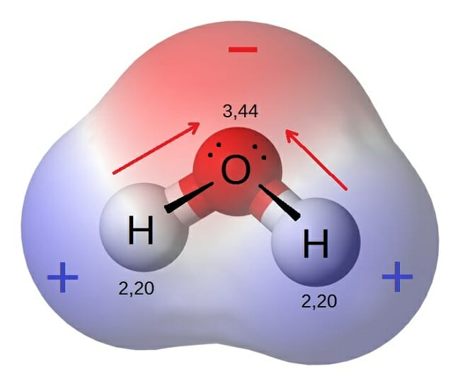

```{r setup, include=FALSE}
knitr::opts_chunk$set(echo = TRUE)
```

# GLM - Generalized Linear Models

- regression line

```{r linearModel}
BOD
lm(demand~Time, data = BOD)

library(tidyverse)
ggplot(BOD, aes(x=Time, y=demand))+
  geom_smooth(method = 'lm')+
  geom_point(size=5)
```

The model is $Y = aX + b$ is a special case of wide class of GLM.

```{r}
glm(demand~Time, data=BOD, family = 'gaussian')
```

y is quantitative, but sometimes y is also qualitative.

## Binomial logistic regression

probability of classification

```{r}
# install.packages()
library(GLMsData)
data(nminer)
nminer
```

```{r correlations}
library(corrplot)
correlations <- cor(nminer[,c(2,4:7)])
correlations
corrplot(correlations, method='circle')
```

Multiple regression analysis, we test more predictors  simultaneously.

```{r}
nminer.mod <- glm(Miners ~ Eucs + Grazed + Shrubs + Timber,
                  data=nminer,
                  family = 'binomial')
summary(nminer.mod)
```

$\alpha$ is the intercept
$\beta$ are partial regression slopes.

$y_1 = \alpha + \beta_1 x_{1i} + \beta_2 x_{2i} + \beta_p x_{pi} + \epsilon_i$

```{r}
nminer.mod <- glm(Miners ~ Eucs + Grazed + Timber,
                  data=nminer,
                  family = 'binomial')
summary(nminer.mod)
```

```{r prediction}
glm.probs <- predict(nminer.mod, type='response')
nminer$Prob <- glm.probs
nminer$MinersPred <- ifelse(glm.probs>0.5,1,0)
nminer

as_tibble(nminer)
```

```{r cross-tab}
nminer %>% 
  select(Miners, MinersPred) %>% 
  table
```

Confusion matrix

```{r confusion matrix}
library(caret)
nminer %>% 
  select(Miners, MinersPred) %>% 
  table %>% 
  confusionMatrix
```

More info for caret package on [jstatsoft.org](https://www.jstatsoft.org)

?family

# R Markdown for your PhD thesis

## Basic elements:

1. figures
2. tables
3. cross citations
4. references
5. output from multiple files for big projects (like your thesis)


### Figures

```{r}
airq <- as_tibble(airquality)
airq

airqTemp <- airq %>% 
  mutate(TempC=(Temp-32)*5/9) %>% 
  group_by(Month) %>% 
  summarise(mean=mean(TempC),
            sd=sd(TempC),
            min=min(TempC),
            max=max(TempC),
            n=n())
```

```{r pointrange, fig.cap='Temp mean values and standard deviation', fig.align='center', fig.width=6, fig.height=4}
ggplot(airqTemp, aes(x=Month, y=mean))+
  geom_pointrange(aes(ymin=mean-sd,
                      ymax=mean+sd))
```

```{r}
library(patchwork)
p1 <- ggplot(airqTemp, aes(x=Month, y=mean))+
            geom_pointrange(aes(ymin=mean-sd,
                      ymax=mean+sd))
p2 <- ggplot(airq, aes(x=Temp))+
  geom_histogram(fill='steelblue')
p3 <- ggplot(airq, aes(x=Month, y=Ozone, group=Month))+
  geom_boxplot(aes(fill=as_factor(Month)))+
  theme(legend.position = 'none')

p1 + p2 + p3
```

Tagging symbol are:

- 1 for arabic num
- A or a for letter
- I or i for Roman numerals

```{r patch, fig.cap='caption'}
p2 / (p1 + p3) + plot_annotation(tag_levels = 'i')
```

the web site https://patchwork.data-imaginist.com

#### External figures

```{r}
library(knitr)
download.file('https://biologydictionary.net/wp-content/uploads/2017/02/Water-is-polar-molecule.jpg', 'water.jpg')
```

```{r water, fig.cap='water molecule.', fig.align='center',out.width='50%'}

```

### Tables

```{r tempTab}
kable(airqTemp, 
      caption = 'Descriptive statistics for Temp',
      digits = 2,
      align = c('c','r','r','l','l','l'))

# ?kable
```

### Cross citations {#subcitation}

``` markdown
- \@ref(type:label)
```

see figure \@ref(fig:water) for the molecule.

see table \@ref(tab:tempTab)

\begin{equation}
y = a + bx (\#eq:linear)
\end{equation}

see equation \@ref(eq:linear)

see the sub-section \@ref(subcitation)

### References

``` markdown
- [@article-handle]
```

this is a citation of [@koch_seasonal_2020; @brand_abundance_2020] and the label is 'brand_abundance_2020'

## References

<div id='refs'></div>